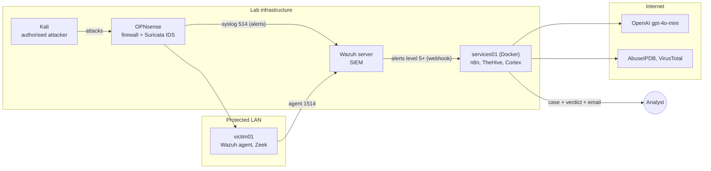

# Agentic SOC

A security operations centre that fits on one laptop, where an AI analyst does the first read of every alert and a human makes every decision.

A Kali machine fires an nmap scan at a victim server. Within about a minute, Suricata on the OPNsense firewall has flagged it and Wazuh has turned it into an alert. n8n has opened a case in TheHive and asked AbuseIPDB and VirusTotal what they know about both addresses. A gpt-4o-mini Level 1 analyst has then read the facts and written a verdict on the case: what it thinks happened, how sure it is, the innocent explanation it considered, and what a person should check next. If the alert is serious enough, an HTML email lands in the analyst's inbox with a link to the case.

Nothing has been blocked, isolated or deleted. The case sits there, New and unassigned, until a human reads it. The AI holds no passwords and no tools. It can only return text, so even a fully compromised model cannot touch the network. That split of authority is the point of the project: **the workflow acts, the case system stores, the agent advises, the human decides.**

It is built as a teaching lab for enterprise SOC and incident response work, from free and open-source parts, on one Intel Mac running VMware Fusion.

## What runs where



| Piece | Job |
|---|---|
| Wazuh 4.14 | Collects logs from every machine, runs the detection rules, raises alerts. Only Wazuh creates alerts. |
| Suricata on OPNsense | Network IDS on both firewall interfaces, IPS mode off (detect only). |
| Zeek on victim01 | Connection records for the protected segment, searchable in Wazuh. |
| n8n | The conveyor belt: normalise, filter, open case, enrich, ask the agent, comment, email. |
| TheHive 5.2 | Cases and the human approval surface. |
| Cortex 4.1 | Runs the AbuseIPDB and VirusTotal analyzers in throwaway containers. |
| gpt-4o-mini (L1 agent) | Reads the facts, writes a JSON verdict. No tools, no credentials. |
| L2 agent (Python) | Builds a timeline and containment proposals for escalated alerts. Advisory only. |

## Quick start

You need an Intel Mac (64 GB RAM recommended), VMware Fusion, about 150 GB free disk, and free API keys for OpenAI, AbuseIPDB and VirusTotal.

```bash
git clone <REPO_URL> Agentic_SOC && cd Agentic_SOC
cp .env.example .env && chmod 600 .env     # fill in every <PLACEHOLDER>
./install.sh preflight                     # checks .env and reaches every lab machine
./install.sh opnsense                      # prints the firewall steps (GUI install)
sudo ./install.sh wazuh                    # on the Wazuh VM
sudo ./install.sh services                 # on services01
sudo ./install.sh workflow                 # on services01, imports the n8n pipeline
sudo ./install.sh agent victim01           # on each endpoint
sudo ./install.sh sensor                   # on victim01 (Zeek)
sudo ./install.sh mac-dns                  # on the Mac host
scripts/healthcheck.sh                     # from the Mac, after any restart
```

Every role accepts `--dry-run`, backs up each file before editing it, tests the configuration and rolls back if the test fails. The full walkthrough, including the manual first-run screens, is in [docs/04-installation](docs/04-installation/README.md).

## Repository map

| Folder | What is in it |
|---|---|
| [docs/01-plan](docs/01-plan/README.md) | Goals, build phases and what is done, roadmap for the next agents |
| [docs/02-architecture](docs/02-architecture/README.md) | Deployment, alert flow, the n8n pipeline node by node, design decisions |
| [docs/03-lab](docs/03-lab/README.md) | Machines, addresses, accounts, the central lab reference |
| [docs/04-installation](docs/04-installation/README.md) | Step-by-step build for every machine, and the installer |
| [docs/05-configuration](docs/05-configuration/README.md) | Every config file: what it does, where it goes, how to test and roll back |
| [docs/06-operations](docs/06-operations/README.md) | Cold start, validation tests, known behaviours, the change runbook |
| [docs/07-troubleshooting](docs/07-troubleshooting/README.md) | 50+ real faults from this build: symptom, cause, fix |
| [docs/08-incident-reports](docs/08-incident-reports/README.md) | Worked incident report (port-scan-001) and its fact check |
| [docs/09-agents](docs/09-agents/README.md) | The agent pattern, the L1 build, the L2 and detection-engineering agents |
| [agents/](agents/) | Agent prompts and code |
| [configs/](configs/) | Wazuh rules and decoders, Docker stack, n8n workflow and code nodes, Zeek, macOS |
| [scripts/](scripts/) | Health check and read-only queries |
| [tests/fixtures](tests/fixtures/) | Sample escalated alert for the L2 agent |

## The safety rules this lab is built on

1. The AI agents hold no credentials and no tools. They return text.
2. Read-only steps run on their own (lookups, summaries, comments). Anything that changes the environment waits for a person.
3. Cases are created New and unassigned. Emails are notifications, never actions.
4. Suricata runs in IDS mode. IPS would make the firewall block traffic by itself, which would break rule 2.
5. Secrets never enter this repository. See [SECURITY.md](SECURITY.md).

## Status

Working end to end since 1 October 2026: Suricata and host alerts from four agents become enriched, triaged TheHive cases, and high-severity ones send an email. Next on the roadmap are the detection-engineering agent, wiring the L2 agent into the workflow, and one approval-gated response action (block an address at OPNsense). See [docs/01-plan](docs/01-plan/README.md).

## License

[MIT](LICENSE). Use, copy, modify and share it, including for your own courses, as long as the copyright notice and licence text stay with it. The tools the installer downloads (Wazuh, n8n, TheHive, Cortex, Suricata, Zeek and the rest) keep their own licences.
