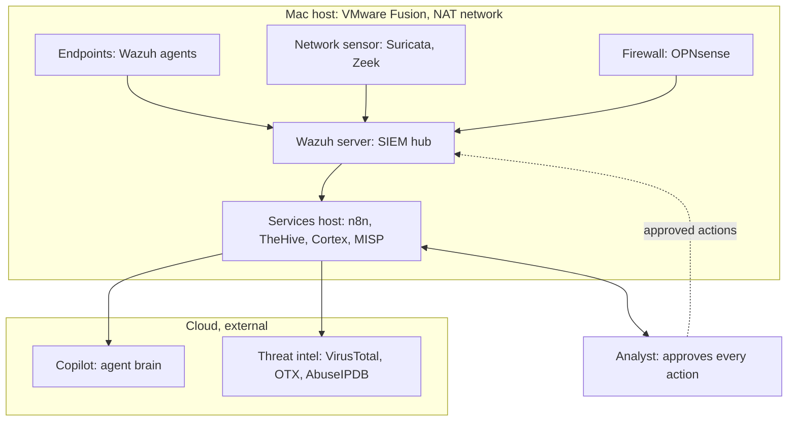

> Source: `soc_lab_1_plan.md` (lab session notes). Screenshots and personal details were removed for publication; commands are unchanged except where marked.

# SOC Agent Lab: Plan

The design for a self hosted SOC and incident response lab on one Mac running VMware Fusion, with an agent that automates Level 1 and Level 2 work and asks you to approve every action.

Host machine assumed: Intel Mac, 64 GB RAM, about 150 GB free disk. RAM is plentiful and disk is tight, so the design packs services into containers and keeps strict log retention.

```
Note on typing: the writing here avoids hyphens so it reads easily, but any commands and web links in the Infrastructure document must be typed exactly as shown, including hyphens they contain.
```

---

## The idea in one paragraph

Every part of your fake company sends its logs into one collection point, the Wazuh server. When a rule matches, that becomes an alert. A workflow tool called n8n picks up the alert and hands a tidy package of facts to a small AI model (Copilot free tier). The AI reads the facts, pulls reputation data from your threat intelligence tools, writes a plain verdict, and proposes what to do. Nothing that changes your environment happens until you say yes. That approval step is the whole point.

## Architecture design (deployment view)

This is a picture of what runs where, not the order events flow. There are two zones. Everything inside the dashed host box runs locally on your Mac inside VMware Fusion, on one shared NAT network so the machines can talk to each other and reach the internet. Everything in the cloud box is external, reached over the internet, which means data leaves your machine when you call it. You, the analyst, sit outside the automatic path on purpose.



Reading the design:

The collection hub is the Wazuh server. All telemetry from the endpoints, the network sensor and the firewall lands here, gets put into a common shape, and gets checked against detection rules. It is the only component allowed to create an alert.

The automation hub is the services host. It is a single machine running several tools in Docker containers to save disk: n8n for workflows, TheHive for cases and approvals, Cortex for running enrichment analyzers, and MISP for threat intelligence. This is the busy integration point that talks to the cloud and to you.

The cloud edge is where the design leaves your machine. The Copilot model does the reasoning, and the threat intel APIs answer reputation questions. Both are external, so treat anything sent to them as leaving the lab.

You are the gate. The services host proposes actions and waits. Approved actions flow back into the host to act, shown as the dashed line returning to Wazuh, which then isolates a host, or to the firewall to block, or to the identity system to disable an account.

## How data moves, in order

First, telemetry from every source lands in the Wazuh server and may raise an alert. Second, n8n on the services host picks up the alert and opens a case in TheHive. Third, n8n sends the facts to Copilot for triage, and to the threat intel tools for reputation. Fourth, Copilot writes a verdict and, when needed, a containment proposal. Fifth, the proposal waits for you. Sixth, only after your approval does a response action run.

## What Level 1 and Level 2 map to

Level 1 is triage and enrichment: is this alert real or noise, what kind is it, how bad is it, gather the reputation facts, open a case, escalate if needed.

Level 2 is investigation and response: connect this alert to others, build a timeline, find the likely cause, pull out the indicators, and propose containment for your approval.

## Tools needed

| Domain or job | Tool | What it does | Where it runs |
|---|---|---|---|
| Endpoint (EDR) | Wazuh agent | Endpoint telemetry, file integrity, active response | On each endpoint |
| SIEM | Wazuh server (manager, indexer, dashboard) | Collect, normalize, correlate, alert, store | Wazuh VM |
| Network detection | Suricata and Zeek | Signature alerts plus rich connection data | Sensor VM |
| Firewall | OPNsense | Perimeter control and block enforcement | Firewall VM |
| Orchestration and SOAR | n8n | Workflow automation, the conveyor belt | Services VM |
| Case management and approval | TheHive | The case record and the human approval surface | Services VM |
| Analyzer engine | Cortex | Runs enrichment analyzers and responders | Services VM |
| Threat intelligence | MISP with OTX and AbuseIPDB | Indicator reputation and correlation | Services VM plus cloud feeds |
| File and address reputation | VirusTotal free API | Hash, domain and address reputation lookups | Cloud API |
| Identity and auth | Authentik (or Keycloak) | Login events and account disable action | Services VM |
| Agent brain | Copilot free tier | Triage, investigation, and proposals | Cloud |
| VPN (later phase) | WireGuard or OpenVPN | Remote access logs to correlate | Added later |

A self hosted detonation sandbox was left out by choice. File and address reputation is covered by VirusTotal and the threat intelligence feeds instead, which cost no local disk.

## Virtual machines and sizing

Disks in Fusion are thin, so the disk number is the cap, not the day one usage.

| Virtual machine | Tools on it | RAM | vCPU | Disk (thin) |
|---|---|---|---|---|
| Wazuh server | Manager, indexer, dashboard | 8 GB | 4 | 60 GB |
| Services host | Docker: n8n, TheHive, Cortex, MISP, Authentik | 12 GB | 4 | 60 GB |
| Network sensor | Suricata, Zeek | 4 GB | 2 | 25 GB |
| Firewall | OPNsense | 2 GB | 2 | 20 GB |
| Endpoints | Wazuh agent (linked clones) | 2 GB | 1 | 20 GB each |

Everything running at once is about 32 GB of RAM, well inside your 64 GB.

## The human approval rule

Read only steps run automatically, because they change nothing: reputation lookups, reading a hash, writing a summary into a case. State changing steps always stop and wait for you: isolate a host, block an address, disable an account, remove an email. The AI model never holds tool credentials and never calls a response tool. Only n8n calls response tools, and only after reading your approval. If you do not approve in time, the workflow holds or escalates and never acts.

## Build order and first milestone

Build in this order, each piece working before the next depends on it:

1. Lab foundation: the host, the NAT network, a clean base machine to clone from.
2. Telemetry: Wazuh server plus one or two endpoints reporting in.
3. Detection: the network sensor and firewall feeding Wazuh, with a small tuned rule set.
4. Enrichment: MISP, Cortex and the free API keys.
5. Orchestration and cases: n8n and TheHive, with alerts creating cases automatically.
6. Agent in read only mode: Copilot writes verdicts and summaries into cases but cannot act.
7. Approval gate and limited response: turn on approvals and a few reversible actions.
8. Validation: simulate attacks and tune false positives.

First milestone: get steps 1 through 6 working and run the agent in read only mode for a couple of weeks. Judge the quality of the cheap model on real alerts before you ever let it propose actions. This order protects your environment while you learn how far the free tier model can be trusted.
