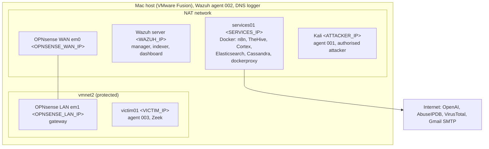
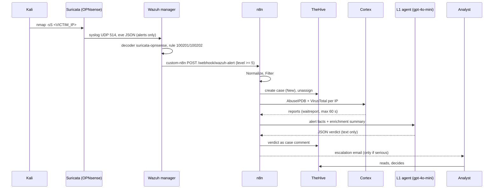

# Architecture

## Deployment

Everything runs on one Intel Mac (64 GB RAM) inside VMware Fusion, on two virtual networks.

Kali reaches the protected LAN only through OPNsense (a static route via &lt;OPNSENSE_WAN_IP&gt;), so every attack on victim01 crosses the firewall where Suricata watches. Traffic between machines on the NAT segment never crosses OPNsense: the VMware virtual switch delivers it directly. That is a known blind spot, recorded in [troubleshooting](../07-troubleshooting/README.md).

## How an alert travels

Host alerts (sshd brute force, file-integrity changes, sudo) follow the same path from the Wazuh agents, without the syslog hop.

## The n8n pipeline, node by node

The workflow is exported in [configs/n8n/wazuh-alert-pipeline.workflow.json](../../configs/n8n/wazuh-alert-pipeline.workflow.json), and each Code node is also saved on its own in [configs/n8n/code-nodes/](../../configs/n8n/code-nodes/).

| # | Node | What it does |
|---|---|---|
| 1 | Webhook | `POST /webhook/wazuh-alert`, receives every Wazuh alert of level 5 or higher |
| 2 | Normalize | Flattens Suricata (`src_ip`, `dest_ip`) and host alerts (`srcip`, `dstip`) into one shape: `agent_name, source_ip, dest_ip, user, file, rule_*, signature, raw` |
| 3 | Filter | Keeps `rule_level >= 5` AND (not group `ossec`, OR a `syscheck` change on a persistence path such as cron, systemd, sudoers, LaunchDaemons, `authorized_keys`) |
| 4 | HTTP Request (create case) | Title `[suricata] <signature> (<src> -> <dst>)` or `[agent] <rule description>`, status New |
| 5 | Unassign Case | TheHive assigns API-created cases to the creator; this sets the assignee back to empty |
| 6 | Has IPs? | Host alerts with no address skip enrichment instead of stopping the run |
| 7 | Create an observable, Fan out analyzers, Execute an analyzer | One observable per IP; AbuseIPDB and VirusTotal for each |
| 8 | Get Cortex Report | `waitreport?atMost=1minute`; a job that does not finish is reported as unavailable |
| 9 | Build Enrichment Summary / No-IP Enrichment | Success, analyzer error or "unavailable", never "clean". RFC1918 addresses flagged |
| 10 | AI Agent + OpenAI Chat Model | gpt-4o-mini, temperature 0.2, no tools. Prompt in [agents/l1-triage](../../agents/l1-triage/) |
| 11 | Parse Verdict | Parses the JSON; on bad output falls back to "manual triage required" |
| 12 | HTTP Request1 (comment) | Posts the verdict as a case comment |
| 13 | Escalate? | `(level >= 10 AND (AI severity high/critical OR group authentication_failures)) OR Suricata severity 1` |
| 14 | Format Email, Send Email | HTML and text email with a case link. Notification only |

## Design decisions

| Decision | Reason |
|---|---|
| The agent has no tools and no credentials | The approval gate is a fact of the wiring, not a rule the model is trusted to follow. The least trustworthy component holds the least power. |
| Cases are created before the verdict exists | Every alert gets a case even if the model fails. The verdict arrives as a comment. |
| Suricata in IDS mode, never IPS | IPS on the WAN would drop traffic automatically, which is an action without approval. |
| OPNsense sends to Wazuh by syslog, not an agent | A Wazuh agent on FreeBSD was more trouble than it was worth. Side effect: Suricata alerts show `agent.name = wazuhserver`, so rules add `$(hostname) $(in_iface)`. |
| Integration threshold at level 5, all agents, no rule filter | n8n's Filter decides what becomes a case, in one visible place. |
| DNS and Zeek rules at level 3 | Searchable in Wazuh, below the integration threshold, so they never open a case or call the model. |
| File-integrity cases only for persistence paths | All of /etc gave about 180 cases per apt upgrade on Kali; the persistence list gave 0 on normal days and 38 on the upgrade day. |
| Cortex reaches Docker through a socket proxy | Mounting the raw socket let Cortex chown it and broke Docker on the host. |
| Responders disabled in Cortex | Responders act. Actions belong to n8n after human approval. |
| Escalation email needs level >= 10 as well as the AI rating | The model's severity varies between runs; the rule level anchors it. |

## Accepted risks

- services01, the SOC tooling, sits on the same flat segment as the Kali attacker. Fine for a lab, wrong for production.
- Alert facts (addresses, file paths, rule text) are sent to OpenAI. Nothing else leaves the lab, and file contents never do (`report_changes` is off).
- Reputation services know nothing about private addresses, so against the lab's 10.x and 192.168.x addresses they mostly prove that enrichment works rather than add intelligence.
